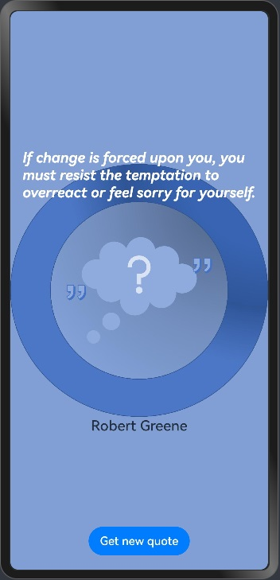

# Quote of the day
## Introduction

Quote of the day is a simple example of getting data from a web source.



### Table of contents
 [Functionaility](#functionaility)  
 [General Process](#general-process)

## Functionaility
    •  App that shows an inspirational quote at the click of a button.
    •  Show how to access data from the web.
    •  Quotes are sourced from https://github.com/tlcheah2/stoic-quote-lambda-public-api
	
## General Process
This part introduces the general process of the application development  
1. [Logic and functionailities](#logic-and-functionailities)
2. [Checking and testing](#checking-and-testing)
    
### Logic and functionailities
- The basic logic of the app is as follows:
    •  Upon launch, connect to the remote API and fetch a fresh quote.
	•  When the user clicks on the button, show him the quote and prepare the next one.

>**Connecting to a web source**

- Within your business logic:
	Initialize an http request to your desired API URL.
	You should know what format of data to expect and prepare accordingly by creating a new 'type' that corresponds to the expected format.
	
```typescript
type quoteType = {
  data: {
    author: string,
    quote: string
  }
}	
	
```	
	
Afterwards call the request and parse your response to your type to extract desired fields.
Keep in mind that the call is asynchronous.
	

```typescript
import http from '@ohos.net.http';
(...)
getNewQuote() {
    http.createHttp().request(API_URL, (error, values) => {
      if (!error) {
        let parsed: quoteType = JSON.parse(values.result as string);
        this.author = parsed.data.author;
        this.quote = parsed.data.quote;
      } else {
        console.log('Error: ' + JSON.stringify(error));
      }
    })
  }
```

All that is left is displaying the data to the user.

### Checking and Testing
- Since some actions in the app are asynchronous, using console logs was the preferred verification method.
  All functionalities can be tested on the `Previewer` or on an `Emulator`.
